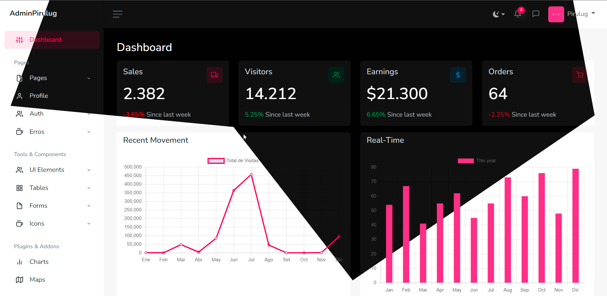

<div align="center">
  

# AdminPiru - Bootstrap 5 Dashboard

  
</p>

<p align="center">A professional administration and dashboard template based on Bootstrap 5, equipped with a wide variety of user interface components, forms, tables, charts, pages, and icons. AdminPirulug stands out by not relying on jQuery or any third-party libraries used by AdminPiru.</p>

<p align="center">
	<a href="https://pirulug.github.io/adminpiru-bootstrap-5-dashboard/">Demo Page</a> | 
	<a href="https://pirulug.github.io/adminpiru-bootstrap-5-dashboard/">Documentation Page</a>
</p>

## Build Tools

The theme includes a custom Webpack file that can be used to quickly recompile and minimize the theme assets while developing or for deployment. You'll need to install Node.js before using Webpack.

Once Node.js is installed, run `npm install` to install the remaining dependencies for AdminKit. All dependencies will be downloaded to the `node_modules` directory.


```bash
npm install
```

Now you're ready to modify the source files and generate new files in the dist/ folder. AdminKit uses webpack-dev-server to automatically detect changes in files and start a local web server at http://localhost:8989.

```bash
npm start
```

Compile, optimize, minimize, and obfuscate all source files into the dist/ folder:

```bash
npm run build
```

## License

AdminPirulug is distributed under the [Licencia MIT](./LICENSE).

## Author

AdminPirulug was created by <a href="https://github.com/pirulug">Pirulug</a>.
