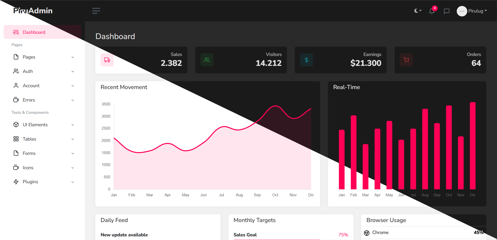

<div align="center">
  
</div>

<h1 align="center">PiruAdmin — Bootstrap 5 Dashboard</h1>

<div align="center">


[](https://github.com/pirulug/piruadmin-bootstrap-5-dashboard/issues)
[](https://github.com/pirulug/piruadmin-bootstrap-5-dashboard/network)
[](https://github.com/pirulug/piruadmin-bootstrap-5-dashboard/stargazers)
[](https://github.com/pirulug/piruadmin-bootstrap-5-dashboard/blob/master/LICENSE.txt)

</div>

<p align="center">
  
</p>

<p align="center">A professional admin dashboard template built on Bootstrap 5. No jQuery, no unnecessary dependencies — just clean, modern, and maintainable code.</p>

<p align="center">
  <a href="https://pirulug.github.io/piruadmin-bootstrap-5-dashboard">Live Demo</a> |
  <a href="https://github.com/pirulug/piruadmin-bootstrap-5-dashboard/blob/master/CHANGELOG.md">Changelog</a>
</p>

---

## Features

- Built with **Bootstrap 5** — no jQuery dependency
- Custom **SCSS** architecture with a dynamic `$prefix` variable system
- **Dark Mode** support via Bootstrap's `color-mode` API
- Interactive **UI Documentation** with collapsible code examples (PrismJS + Copy to Clipboard)
- **Authentication Pages** — Sign In, Sign Up, Forgot Password, Reset Password
- **Dashboard** with charts and statistics
- Plugin integrations: SweetAlert2, Toastify JS, Lite YouTube, Tagify, Datatables, Google Maps, ApexCharts
- Fully **responsive** layout

## Pages

| Category | Pages |
| :--- | :--- |
| **Dashboard** | Main Dashboard |
| **UI Components** | Buttons, Alerts, Badges, Cards, Avatars, Images, Tabs, General |
| **Forms** | Basic Inputs |
| **Tables** | Basic Tables |
| **Plugins** | Charts, SweetAlert2, Toastify, Lite YouTube, Tagify, Datatables, Google Maps |
| **Authentication** | Sign In, Sign Up, Forgot Password, Set New Password |
| **Account** | Profile, Settings |
| **Error Pages** | 404, 500 |

## Build Tools

This project uses **Webpack** with `pnpm`. You'll need [Node.js](https://nodejs.org/) installed before proceeding.

### Install dependencies

```bash
pnpm install
```

### Start development server

Starts a local web server at `http://localhost:8989` with hot reload:

```bash
pnpm start
```

### Production build

Compiles, optimizes, and minifies all assets into the `dist/` folder:

```bash
pnpm run build
```

## Project Structure

```
src/
├── img/              # Images and assets
├── js/               # JavaScript modules (sidebar, toggle-password, etc.)
├── plugins/          # Third-party plugin styles
├── scss/
│   ├── base/         # Variables, typography, resets
│   ├── components/   # Buttons, cards, badges, etc.
│   ├── layout/       # Sidebar, navbar, footer, wrapper
│   ├── mixins/       # SCSS mixins
│   ├── pages/        # Page-specific styles (auth, dashboard, etc.)
│   ├── plugins/      # Plugin-specific styles
│   └── utilities/    # Helpers and utility classes
└── view/
    ├── layouts/      # Base layout templates (main, auth)
    └── pages/        # All page templates (PUG)
```

## License

PiruAdmin is distributed under the [MIT License](./LICENSE).

## Author

Created by [Pirulug](https://github.com/pirulug).
