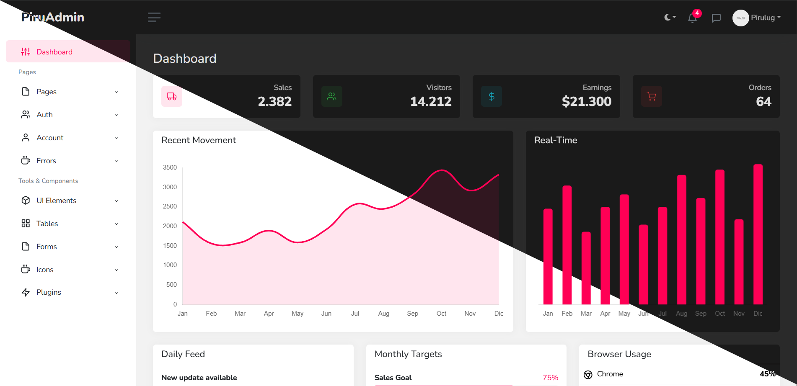

<div align="center">
  
</div>

<h1 align="center">PiruAdmin — Bootstrap 5 Dashboard</h1>

<div align="center">

[](https://github.com/pirulug/piruadmin-bootstrap-5-dashboard)
[](https://github.com/pirulug/piruadmin-bootstrap-5-dashboard/issues)
[](https://github.com/pirulug/piruadmin-bootstrap-5-dashboard/network)
[](https://github.com/pirulug/piruadmin-bootstrap-5-dashboard/stargazers)
[](https://github.com/pirulug/piruadmin-bootstrap-5-dashboard/blob/master/LICENSE)

</div>

<p align="center">
  <strong>English</strong> | <a href="./README.es.md">Español</a>
</p>

<p align="center">
  
</p>

<p align="center">A modern, clean, and modular admin dashboard template built with Bootstrap 5 and Vanilla JavaScript. Zero jQuery dependencies, fully responsive, and packed with pre-built components and pages.</p>

<p align="center">
  <a href="https://pirulug.github.io/piruadmin-bootstrap-5-dashboard">Live Demo</a> |
  <a href="https://github.com/pirulug/piruadmin-bootstrap-5-dashboard/blob/master/CHANGELOG.md">Changelog</a>
</p>

---

## Features

- **Bootstrap 5 Architecture**: Built with modern Bootstrap 5 and Vanilla JavaScript (no jQuery).
- **Theme Support**: Native Light and Dark mode switching with persistent state.
- **Modular SCSS**: Well-structured SCSS architecture using dynamic CSS variables and customizable design tokens.
- **Pug Template Engine**: Fast, maintainable, and DRY HTML templates powered by Webpack.
- **Extensive UI Components**: Complete suite of customized Bootstrap components with live code preview and copy-to-clipboard functionality.
- **Icon Libraries**: Integrated support for Bootstrap Icons, Font Awesome, Feather Icons, and Flag Icons.
- **Popular Plugins**: Pre-configured integrations for Chart.js, SweetAlert2, Toastify, Flatpickr, Tagify, Lite YouTube, and more.
- **Authentication & Security**: Sign In, Sign Up, Password Recovery, 2-Step Verification, Lock Screen, and Backup Codes.
- **Responsive Layout**: Fluid sidebar navigation with mobile overlay and collapsible submenus.

---

## Icon Libraries

The template supports multiple popular icon libraries out of the box:

### Bootstrap Icons (Default)
```html
<i class="bi bi-bootstrap-fill"></i>
```

### Font Awesome
```html
<i class="fa-solid fa-house"></i>
```

### Feather Icons
```html
<i data-feather="activity"></i>
```

### Flag Icons
```html
<span class="fi fi-us"></span>
```

---

## Pages and Views

| Category | Available Pages |
| :--- | :--- |
| **Dashboard** | Main Analytics Dashboard |
| **UI Components** | Accordion, Alerts, Avatars, Badges, Buttons, Cards, General, Images, Scrollspy, Tabs |
| **Forms** | Basic Inputs, Rich Text Editor, Flatpickr (Date/Time Picker), Tagify (Tags Input) |
| **Tables** | Bootstrap Styled Tables |
| **Plugins** | Charts (Chart.js), DataTables, SweetAlert2, Toastify JS, Lite YouTube, Google Maps |
| **Icons** | Bootstrap Icons, Font Awesome, Feather Icons, Flag Icons |
| **Pages** | Blank Page, Colors Palette, Search Results, Timeline, Typography |
| **Authentication** | Sign In, Sign Up, Recover Password, Reset Password, 2-Step Verification, 2-Step Verification Code, Backup Codes, Lock Screen |
| **Account** | User Profile, Account Settings |
| **Error / System** | 404 Not Found, 500 Server Error, Maintenance Mode |

---

## Getting Started

### Prerequisites

Make sure you have [Node.js](https://nodejs.org/) (version 18 or higher) installed on your system.

### Installation

Clone the repository and install the dependencies using `pnpm` (or `npm`):

```bash
# Clone repository
git clone https://github.com/pirulug/piruadmin-bootstrap-5-dashboard.git

# Navigate to directory
cd piruadmin-bootstrap-5-dashboard

# Install dependencies
pnpm install
```

### Development Server

Run the development server with live reload at `http://localhost:8989`:

```bash
pnpm start
```

### Production Build

Compile, bundle, and optimize all assets into the `dist/` directory:

```bash
pnpm run build
```

### Deploy to GitHub Pages

Deploy the compiled `dist/` folder directly to GitHub Pages:

```bash
pnpm run deploy
```

---

## Project Structure

```
piruadmin-bootstrap-5-dashboard/
├── src/
│   ├── data/             # JSON datasets (menus, icon definitions)
│   ├── fonts/            # Local web fonts (Inter, Roboto, Google Sans Code)
│   ├── img/              # Images and brand assets
│   ├── js/
│   │   ├── modules/      # Core JS modules (sidebar, theme, password toggle, etc.)
│   │   └── piruadmin.js  # Main JavaScript entry point
│   ├── plugins/          # Third-party plugin integrations and styles
│   ├── scss/
│   │   ├── base/         # Variables, dark theme overrides, resets
│   │   ├── components/   # Custom UI component styles
│   │   ├── layout/       # Sidebar, navbar, footer, main content layout
│   │   ├── mixins/       # Custom SCSS mixins
│   │   ├── pages/        # Page-specific styling (auth, profile, timeline, etc.)
│   │   ├── utilities/    # Helper classes and functions
│   │   └── piruadmin.scss# Main SCSS entry point
│   └── view/
│       ├── layouts/      # Master layout templates (dashboard, auth, home)
│       ├── mixins/       # Reusable Pug mixins
│       └── pages/        # Application view templates (Pug)
├── webpack.config.js     # Webpack build configuration
└── package.json          # Project metadata and dependencies
```

---

## License

Distributed under the [MIT License](./LICENSE).

---

## Author

Created and maintained by [Pirulug](https://github.com/pirulug).
